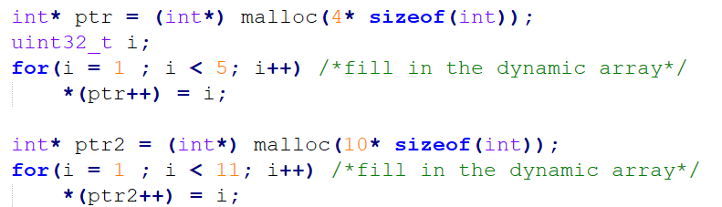
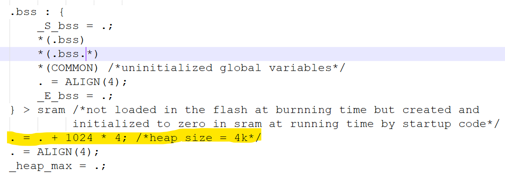
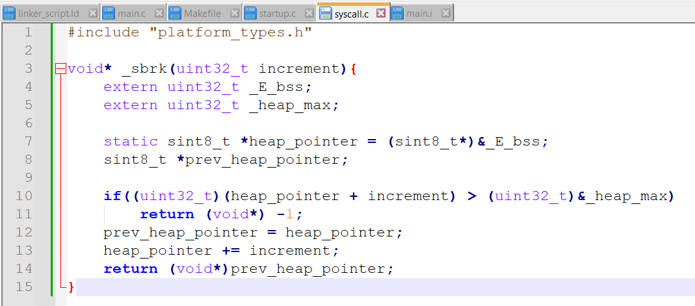

# Unit03/Lab04
## learn how can we perform dynamic allocation in Embedded Systems Baremetal Software
- The same code in lab02
- Create Two dynamically Allocated Arrays in main.c and initialize them

- Add heap section in linker_script.ld

- Implement '_sbrk' which increments the heap pointer with the size of dynamically allocated data and return a pointer to the beginning of the newly allocated space, or (void*)-1 if there is an error (such as running out of memory).

- Run/Debug using keil proteus to make sure it's done.
## Output & Code Analysis:
https://drive.google.com/drive/folders/1OZyG6fXdHxV67EooPtZBTYdRvzO9pe4P