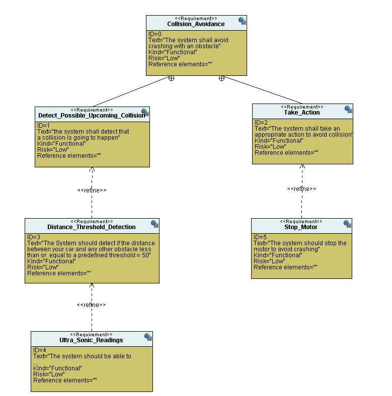
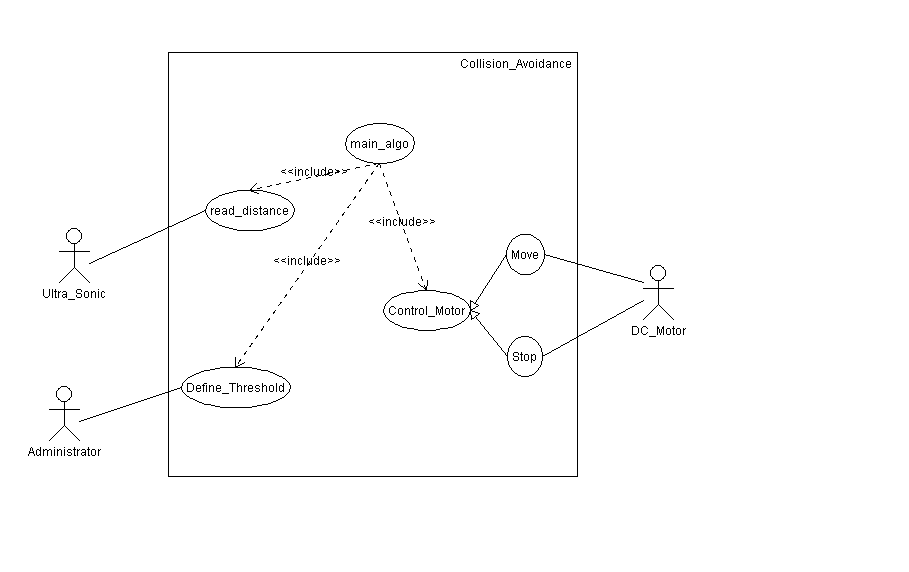
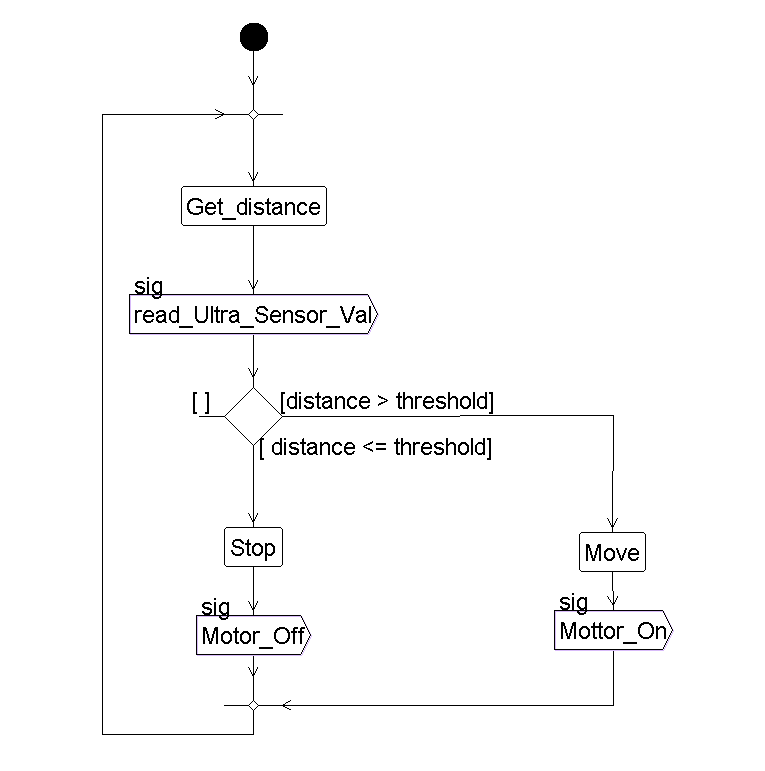
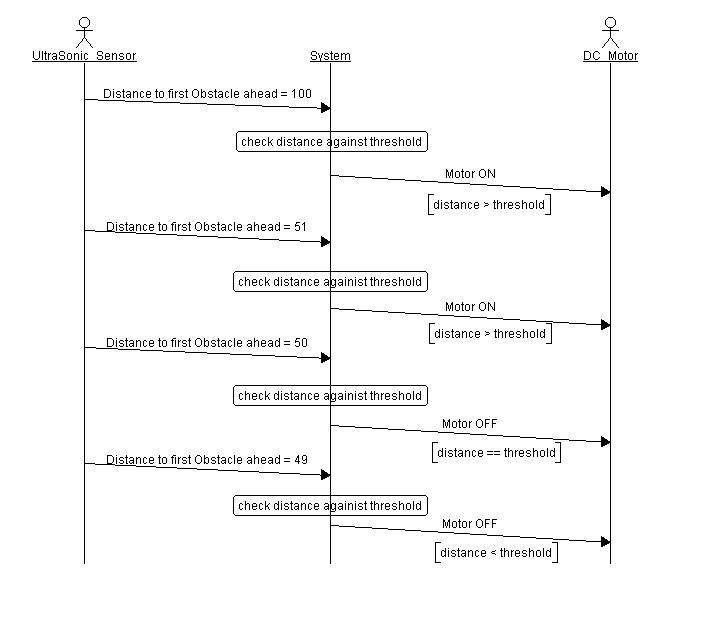
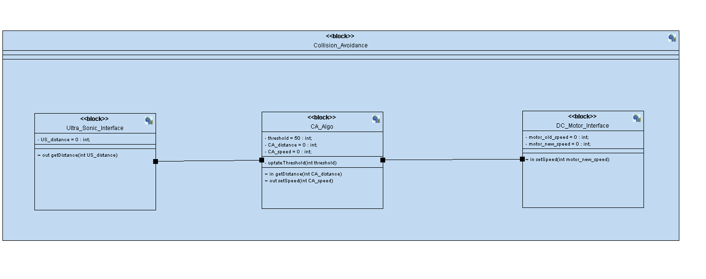
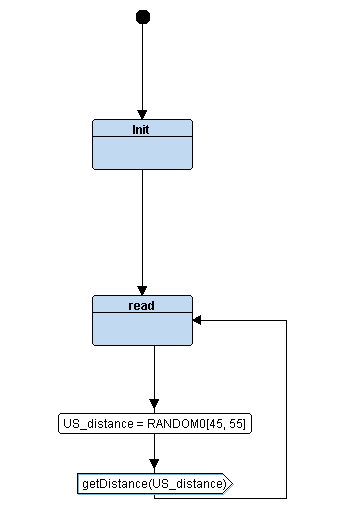
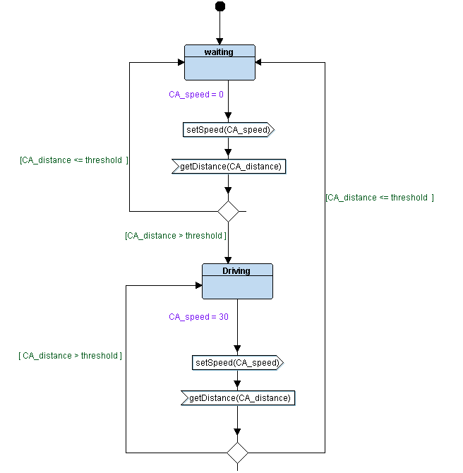
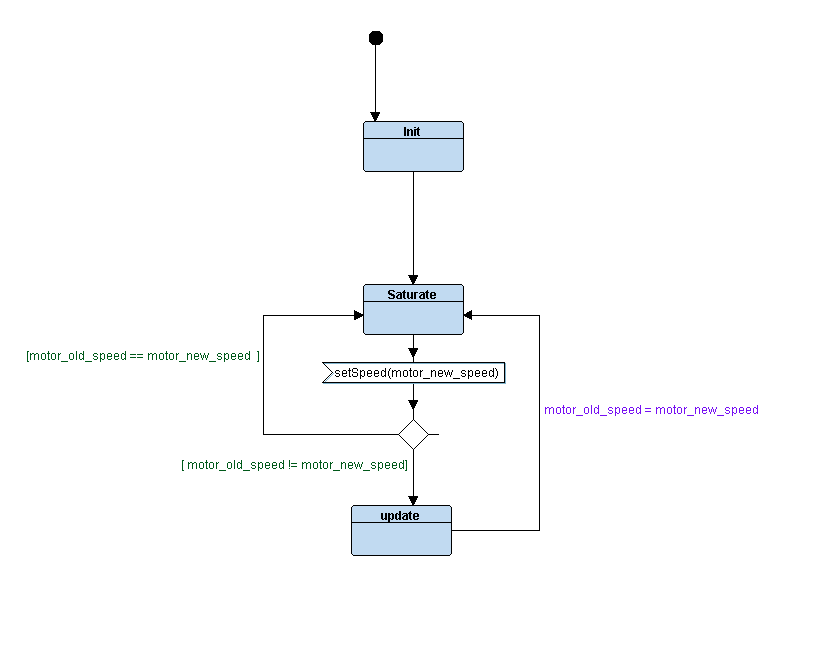
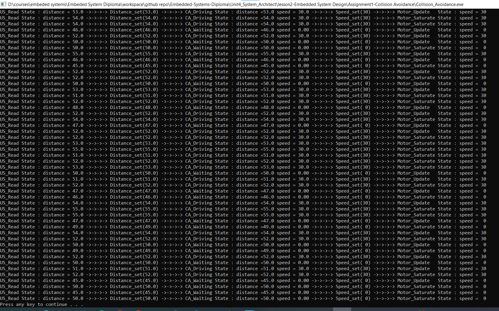

# Unit04/Lesson02/Assignment01-collision Avoidance Project
## Design Sequence
1. Case Study
    - Specifications from the client
    Collision avoidance system that stops a **DC Motor** when it is just 50cm or less from the nearest obstacle.
    - Assumptions
        - Ultrasonic sensor never fails.
        - DC motor never fails
2. Method
    - We are going use **V Model**
3. Requirements Diagram

4. System Analysis
    - Use Case Diagram
    
    
    
    - Activity Diagram
    
    
    
    - Sequence Diagram
    
    

5. System Design
    - Block Diagram
    
    
    
    - State Diagram
        - UltraSonic_interface Block
        
        
        
        - CA main Algorithm Block
        
        
        
        - DC_Motor Interface Block
        
        

## Implementation
- .c, .h for each block
- State.h to carry each block states, modules connectors 
### Output:

