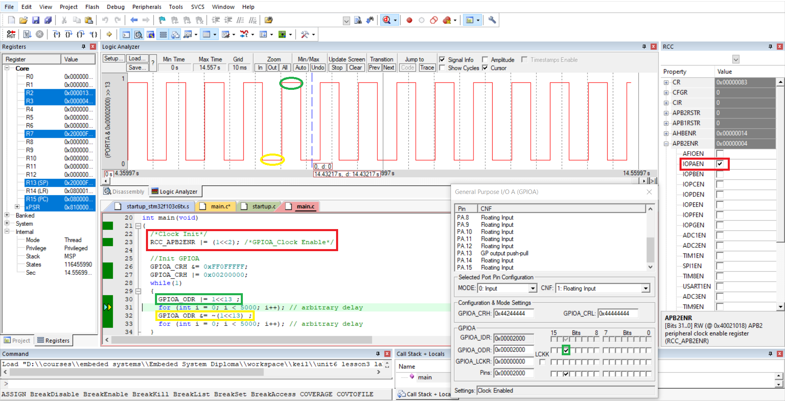

# Unit 06 - Lesson 03 - Lab 01  
## **Toggling PortA Pin 13 on STM32F103C6**  

### **Objective**  
This lab demonstrates the critical role of clock management in electronic circuits and microcontroller units (MCUs). Specifically, it highlights the importance of enabling the clock for peripherals before utilizing them in MCUs with a **Clock Management Unit (CMU)**.  

### **Purpose**  
- Understand the necessity of peripheral clock activation in systems equipped with a Clock Management Unit.  
- Illustrate how the absence of clock enabling can impact the functionality of an MCU peripheral.  

### **Output**  

