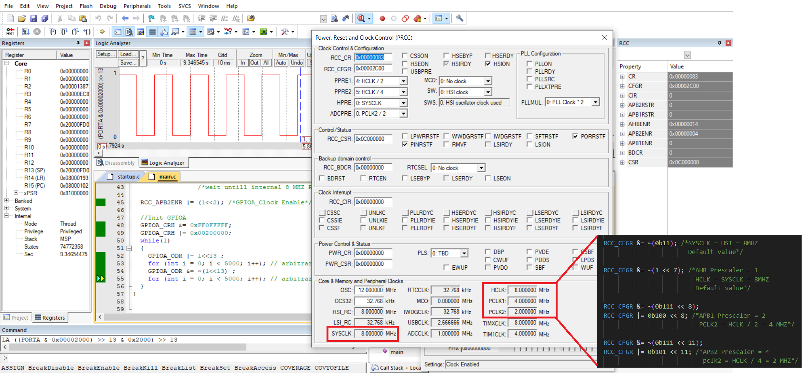

# Unit 06 - Lesson 03 - Lab 02  
## **Requirements**
Configure Board to run with the Following rates:
- APB1 Bus frequency 4MHZ
- APB2 Bus frequency 2MHZ
- AHB frequency 8MHZ
- SysClk 8MHZ 
- Use only internal HSI_RC

## **Output**  
