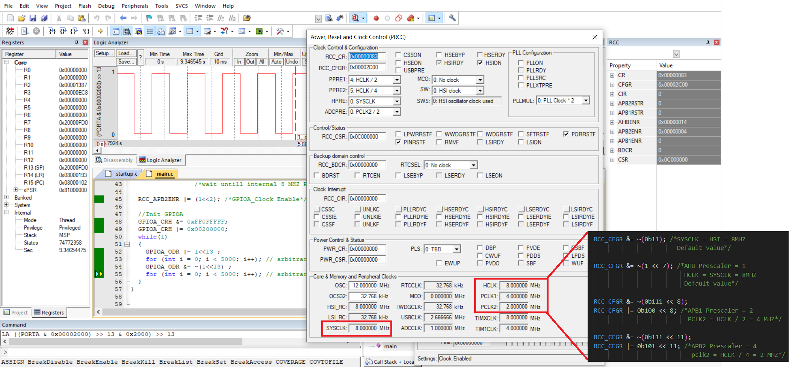

# Unit 06 - Lesson 03 - Lab 02  
## **Requirements**
Configure Board to run with the Following rates:
- APB1 Bus frequency 16MHZ
- APB2 Bus frequency 8MHZ
- AHB frequency 32 MHZ
- SysClk 32 MHZ 
- Use only internal HSI_RC

## **Output**  
