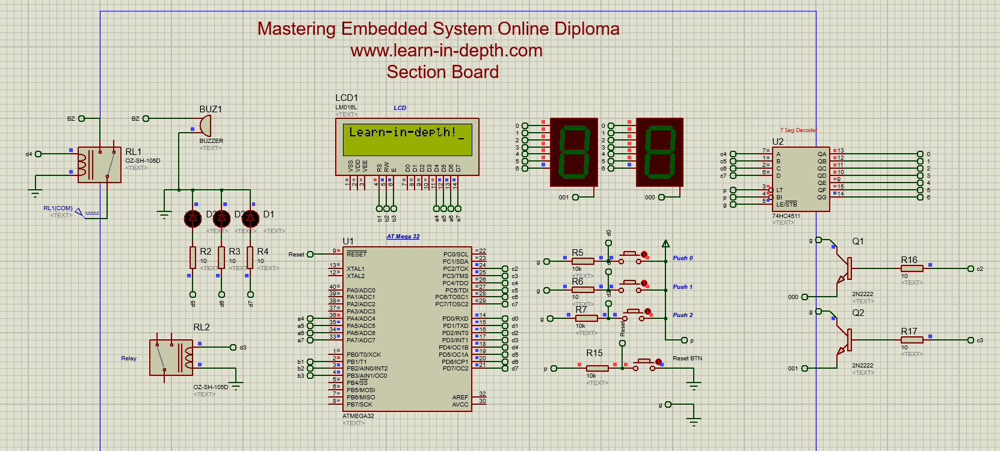

# Unit 07 - Lesson 04 - Section: ATmega32 DIO Driver

## **📌 Project Overview**
This project focuses on implementing a **Digital Input/Output (DIO) Driver** for the **ATmega32** microcontroller. To test the driver, an **LCD** is used to display text. The project was tested on the **Amit Kit** and simulated using **Proteus**.

---

## **🛠️ System Architecture**
The project follows a **layered architecture** consisting of the following layers:

1. **Application Layer**
   - Initializes the **LCD**.
   - Displays a predefined message on the **LCD**.

2. **HAL (Hardware Abstraction Layer)**
   - **LCD Driver**: Controls the LCD using the **DIO Driver**.

3. **MCAL (Microcontroller Abstraction Layer)**
   - **DIO Driver**: Provides functions to configure and control GPIO pins.

```
📂 Unit7_Lesson4_Section
│── 📂 Atmega32_Drivers
│   │── 📂 Inc
│   │   │── Atmega32.h  # MCU Driver Header
│   │   │── Atmega32_DIO.h  # DIO Driver Header
│   │── 📂 GPIO
│   │   │── Atmega32_DIO.c  # DIO Driver Implementation
│── 📂 HAL
│   │── 📂 inc
│   │   │── LCD.h  # LCD Driver Header
│   │   │── Utils.h
│   │── 📂 LCD
│   │   │── LCD.c  # LCD Driver Implementation
│── │main.c  # Main Application Logic
```

---

## **⚙️ Functionality**
1. **System Initialization**
   - Initializes the **DIO driver**.
   - Configures the **LCD** for 4-bit mode.

2. **LCD Display**
   - Displays the message **"Learn-in-depth!"** on the LCD.

3. **Testing and Simulation**
   - The project was tested on the **Amit Kit**.
   - Simulated using **Proteus** to validate correct functionality.

---

## **🔌 Hardware Connections**
### **LCD Connection**
| LCD Pin | ATmega32 Pin |
|---------|-------------|
| RS      | PB1         |
| RW      | PB2         |
| E       | PB3         |
| D4      | PA4         |
| D5      | PA5         |
| D6      | PA6         |
| D7      | PA7         |

---

## **🔧 Drivers Overview**
### **DIO Driver (MCAL Layer)**
The **DIO driver** provides fundamental APIs for pin manipulation:
- `MCAL_DIO_Init(DIO_T*, DIO_PinConfig_T*)` → Initializes a GPIO pin with a specific mode.
- `MCAL_DIO_WritePin(DIO_T*, uint8_t, uint8_t)` → Writes a **HIGH** or **LOW** state to a pin.
- `MCAL_DIO_WritePort(DIO_T*, uint8_t)` → Writes a value to an entire port.
- `MCAL_DIO_ReadPin(DIO_T*, uint8_t)` → Reads the state of a given pin.
- `MCAL_DIO_ReadPort(DIO_T*)` → Reads the entire port value.

### **LCD Driver (HAL Layer)**
The **LCD driver** provides APIs for controlling the LCD:
- `LCD_Init(LCD_Config_t*)` → Initializes the LCD in **4-bit or 8-bit mode**.
- `LCD_Write_Data(char*)` → Displays a string on the LCD.
- `LCD_SendCharacter(char)` → Displays a single character.
- `LCD_Write_Command(char)` → Sends a command to the LCD.
- `LCD_Busy()` → Checks if the LCD is busy before sending data.

---

## **Simulation**
### **Proteus Simulation Screenshot**
Below is a snapshot of the simulation setup:



---

🚀 Developed as part of **Unit 7 - Lesson 04 - Section** in the Embedded Systems Course!
